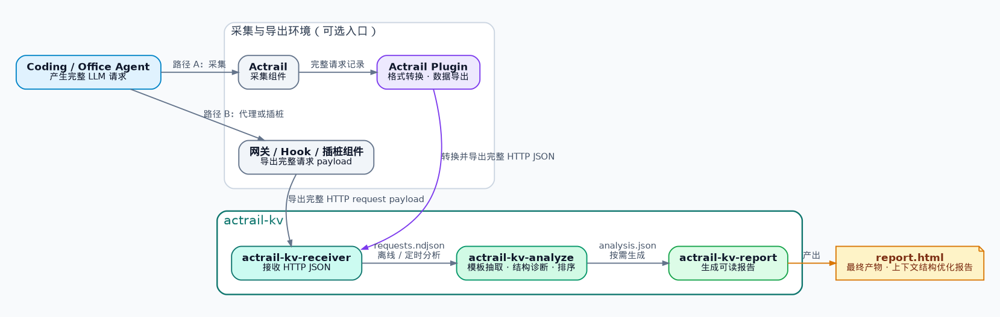

<!-- 本文件帮助第一次接触项目的人理解价值、完成试用并找到后续文档。 -->
# actrail-kv

从一段时间内的真实 LLM 请求中寻找 KV 缓存优化启示：哪些易变内容放得太早，哪些生成方式不够稳定，以及它们阻断了多少本可复用的后续上下文。

## 为什么需要

例如，一个 Coding Agent 每次都发送下面这段 system prompt：

```text
请求 A：You are a coding agent. / Workspace: billing-api.   / Read the repository ... Run tests ...
请求 B：You are a coding agent. / Workspace: search-service. / Read the repository ... Run tests ...
                                      变化                         重新出现的大段稳定内容
```

`actrail-kv` 会把它识别成同一个结构缺陷：

```text
P1：You are a coding agent.
X ：Workspace: <每次变化的工作区>
P2：Read the repository before editing. Run tests after every change.
```

真正值得关注的不是工作区名称不同，而是这个差异挡在了稳定的 `P2` 前面。工具会从一段时间内的完整请求中抽取这类共同结构，合并重复证据，并把最值得处理的问题排到报告前面。

## 部署交互视图



AcTrail项目在[AcTrail](gitcode.com/openeuler/AcTrail)

`actrail-kv` 自身由三个可以独立运行的二进制组成：

| 二进制 | 做什么 | 产物 |
|---|---|---|
| `actrail-kv-receiver` | 接收上游导出的完整 LLM HTTP JSON 请求 | `requests.ndjson` |
| `actrail-kv-analyze` | 抽取模板，定位并聚合上下文结构缺陷 | `analysis.json` |
| `actrail-kv-report` | 把分析结果转换成可以直接阅读的静态页面 | `report.html` |

Receiver 可以持续运行；Analyze 和 Report 可以按需执行，也可以放进定时任务。已有符合输入协议的语料时，可以从 Analyze 直接开始。

## Quick Start Example
用示例语料生成第一份报告

仓库内置了一组最小请求，能够稳定复现开头的 Workspace 缺陷：

```bash
cargo build --release --workspace --bins

demo_output="$(mktemp -d)"

target/release/actrail-kv-analyze \
  --input examples/quickstart/requests.ndjson \
  --output "$demo_output/analysis.json" \
  --top-k 20

target/release/actrail-kv-report \
  --input "$demo_output/analysis.json" \
  --output "$demo_output/report.html"

echo "$demo_output/report.html"
```

在浏览器中打开输出路径，就能看到模板、`P1 / X / P2` 证据、受影响请求数、排序分数和对应的优化启示。

## 接入自己的请求

启动 Receiver：

```bash
target/release/actrail-kv-receiver \
  --listen 127.0.0.1:8080 \
  --output requests.ndjson
```

上游组件把实际发往模型 API 的完整 JSON body 原样提交到 `/requests`。下面只展示最小调用方式；生产环境通常由 Actrail Plugin、网关或插桩组件完成这一步。

```bash
curl --fail-with-body \
  -H 'content-type: application/json' \
  -H 'x-actrail-endpoint-key: llm-primary' \
  -H 'x-actrail-agent-key: coding-agent' \
  --data-binary @request.json \
  http://127.0.0.1:8080/requests
```

`X-Actrail-Endpoint-Key` 告诉分析器哪些请求来自同一个逻辑入口。Agent、模型部署和真实 KV namespace 也可以作为可选分组维度，避免比较本来就不会共享缓存的请求。完整 Header 和落盘格式见 [Receiver 输入](docs/architectures/receiver/input.md)与 [Receiver 输出](docs/architectures/receiver/output.md)。

积累一段时间的请求后，使用与示例相同的 Analyze、Report 命令生成报告即可。

## 报告能回答什么

所有问题都使用同一个 `P1 / X / P2` 结构定位：`X` 是过早出现的差异，`P2` 是被它阻断的稳定内容。下面的大类和子类用于说明 `X` 为什么不同；同一个问题可以同时带有多项事实，不会因为分类而重复计数。

| 问题大类 | 子类 | 能识别的现象 | 推荐的修复策略 |
|---|---|---|---|
| 内容生成不稳定 | 易变值过早出现 | 租户、工作区、时间或其他动态值位于大段稳定内容之前 | 在语义允许时把动态值后移，或把后续稳定内容前移 |
| 内容生成不稳定 | 少量固定版本漂移 | 同一逻辑位置长期出现少数 prompt、tool schema 或配置版本 | 统一模板来源和发布版本，避免实例各自拼装 |
| 内容生成不稳定 | 等价数据表示不同 | JSON 等结构化内容含义相同，但字段顺序、空白或序列化方式不同 | 使用确定性的序列化和格式化方式 |
| 序列生成不稳定 | 中部插入或缺失 | 某些请求在稳定前后文之间多出或缺少 message、tool 或 content block | 如果不改变语义，改为尾部追加；否则统一插入规则 |
| 序列生成不稳定 | 唯一元素顺序漂移 | 同一组可以可靠对应的 tool、block 或其他元素顺序不同 | 使用稳定排序或固定注册顺序 |

一份报告不仅给出问题列表，还保留了判断和排序所需的证据：

| 报告内容 | 代表什么 | 应该怎样使用 |
|---|---|---|
| Comparison Group | 哪些请求处于同一时间窗口、endpoint、模型或部署及可选 Agent、KV namespace | 先确认这些请求在业务上确实有共享缓存的可能 |
| Template | 多个请求共同拥有的稳定结构，以及被不同值填充的槽位 | 理解这些请求为什么被视为同一类调用 |
| `P1` | 差异出现前已经形成的公共前缀 | 表示当前能够稳定复用到的位置 |
| `X` variants 与 facts | 阻断复用的具体差异、出现位置、代表值及变化方式 | 找到负责生成这段内容的模板、配置或序列化逻辑 |
| `P2` / `blocked_stable_bytes` | 差异之后重新对齐的稳定内容及其 UTF-8 字节数 | 作为这次差异导致 KV 重算代价的结构近似；数值越大，通常越值得优先检查 |
| `affected_count` | 同一问题影响的请求数量 | 判断问题是偶发现象还是持续发生 |
| `confidence` | 模板支持度、重新对齐和证据完整度形成的置信程度 | 优先复核高置信问题，低置信问题结合原始请求判断 |
| `score` 与 Top K | `blocked_stable_bytes × affected_count × confidence` 的统一排序 | 用于安排排查顺序，不作为 Token 或金额收益预测 |
| Optimization Insight | 根据差异事实给出的调整方向 | 作为修改入口，实施前仍需确认语义和业务约束 |

当前版本不读取模型服务的真实 KV 命中遥测。因此，报告指出的是有证据支持的结构问题，不会把它包装成已经发生的缓存 miss，也不会凭空换算 Token 或金额收益。优化前仍应由熟悉业务的人确认语义安全，并用线上指标验证实际收益。

## 当前可分析的请求

MVP 面向 OpenAI-compatible chat payload：请求需要包含字符串 `model` 和数组 `messages`，可以包含多轮消息、content blocks、tool definitions 与工具调用历史。

分析器先按时间窗口、endpoint、模型或部署、上下文结构以及可选的 Agent、KV namespace 分组，只在同一组内寻找共同模板。无法识别的 payload、损坏的记录和超过资源预算的请求会被明确跳过并计数，不会混进高置信结论。

## 继续阅读

- [部署交互视图](docs/architectures/deployment.md)：两种采集链路和三个二进制如何协作。
- [什么是请求模板](docs/concepts/template.md)：模板、稳定片段、槽位和请求实例之间的关系。
- [什么是上下文结构缺陷](docs/concepts/context_defect.md)：`P1 / X / P2` 的判定方式和反例。
- [分析流水线](docs/architectures/analyze/pipeline.md)：从语料分组到 Top K 的完整过程。
- [报告数据结构](docs/architectures/analyze/output.md)：`analysis.json` 字段、引用关系和示例。
- [配置参考](docs/configuration.md)：CLI 参数、资源预算与部署设置。
- [架构索引](docs/architectures/index.md)：Receiver、Analyze、Report 的全部输入输出契约。

完整请求和报告都可能包含客户代码、对话、工具参数及其他敏感信息。请把 Receiver 限制在受控网络内，并让 `requests.ndjson`、`analysis.json` 和 `report.html` 遵循同一套内网数据分级、保留和销毁规则。
