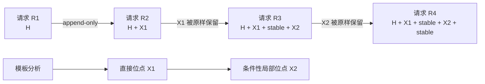

<!-- 本文件记录 v0.1.1 的开发目标、范围与验收要求。 -->
# v0.1.1 开发目标

## 状态

- 目标已确定，进入设计阶段。
- v0.1.1 延续 v0.1.0 的 Agent 侧请求结构分析边界，只使用采集到的 LLM 请求及显式采集元数据。
- v0.1.0 的模板、事实、缺陷和 Top K 语义保持有效；v0.1.1 在此基础上增加 Session 前缀延续与有界多位点分析。

## 背景

v0.1.0 能跨请求抽取稳定片段与动态槽位，并为每个请求模板定位第一个满足条件的 `P1 / X / P2` 缺陷。它不能回答以下问题：

1. 同一 Session 的上一请求已经形成的上下文，在下一请求中保留到哪里、从哪里开始失效。
2. 新追加的动态 tool call、tool result 或 user message，是正常的新内容，还是对既有历史的破坏。
3. 第一个动态位点完成 prefill 并在后续轮次保持不变后，更靠后的动态位点是否成为新的前缀失效点。
4. 同一模板中第一个 `X` 之后还存在哪些可局部优化的 `X → stable` 位点。

动态内容第一次追加到请求尾部不等于破坏既有前缀。只要后续请求原样保留该内容，它就成为后续轮次可复用历史的一部分。v0.1.1 必须显式表达这种逐轮推进的前缀边界。

## 产品目标

v0.1.1 增加“显式 Session 时间线上的多前缀位点分析”，回答两个问题：

1. 对同一 Session 的每次相邻请求转换，上一请求的可观察结构前缀保留了多少，首次在哪里发生变化。
2. 对同一请求模板，第一个缺陷之后还有哪些后续局部位点；这些位点在更早内容已稳定或修复后，可能成为新的首个失效点。

Session 时间线描述每轮已经形成的历史如何延续；模板多位点描述更早差异之后仍存在的局部优化机会。二者提供不同证据，不得重复累计影响。

## P0：Session 前缀延续分析

### 采集协议

- Receiver 必须接受可选 `X-Actrail-Session-Id`。
- 合法值必须作为顶层可选字段 `session_id` 写入 `CapturedRequest`。
- `session_id` 是采集关系元数据，不属于模型可见 payload，不得成为模板差异证据。
- `session_id` 不得进入 `ComparisonMetadata` 或 `ComparisonGroupKey`，不得拆散现有跨 Session 模板分析。
- 未提供 `session_id` 的请求保持 v0.1.0 行为，不推断 Session。
- 一个 `session_id` 在单个分析语料中表示一条线性请求流；v0.1.1 不恢复并发分支或父子请求图。

### 时间线

- 同一 Session 按解析后的 `captured_at` 排序；时间相同时以 `input_line` 作为确定性次序。
- 只比较时间线上的相邻请求，禁止 Session 内全量两两比较。
- Session 可以跨越模板分析的 comparison time window，时间窗口不得截断 Session 时间线。
- 当 endpoint、model、deployment、context schema、KV namespace 或 adapter 等已知可比边界发生变化时，产生 boundary 结果，不归因为历史破坏。
- 无法可靠排序或投影的相邻请求必须显式跳过或标记歧义，不猜测父子关系。

### 前缀比较

- 每个 `previous → current` transition 只有一个有效前缀边界，即两次请求可观察序列的最长公共前缀。
- 比较必须使用 append-aware 的开放序列，不得让 `messages:end`、`tools:end` 等集合结束标记把正常追加误判为分叉。
- 分叉发生在同一可见文本单元内部时，必须在合法 UTF-8 边界上定位。
- 新追加的 user message、assistant message、tool call 或 tool result 不得被报告为历史破坏。
- 已出现的动态内容只要在下一请求原样保留，就必须计入该 transition 的保留前缀。
- 改写、删除或重排上一请求中已经存在的内容时，必须定位首次分叉；同一 transition 中更后的变化不得再次累计前缀影响。

### Transition 结果

每条可比较 transition 至少输出：

- 前后请求 ID 与采集时间；
- `previous_observable_bytes`；
- `current_observable_bytes`；
- `preserved_prefix_bytes`；
- `prefix_retention_ratio = preserved_prefix_bytes / previous_observable_bytes`；
- `invalidated_previous_suffix_bytes = previous_observable_bytes - preserved_prefix_bytes`；
- 首次分叉两侧的结构位置和有界证据；
- 确定性分类：完全相同、正常追加、历史变化、前缀截断、不可比边界或顺序歧义。

这些指标描述可观察 UTF-8 请求结构的前缀保留情况，不得命名为真实命中 Token 或可避免成本。`current_observable_bytes - preserved_prefix_bytes` 也不得直接称为损失，因为其中可能包含正常的新追加内容。

### 聚合与建议

- Session 历史变化必须独立于现有 `templates / defects / top_k` 建模和展示。
- 只聚合历史变化，不把正常追加纳入优化问题。
- 聚合至少包含发生次数、受影响 Session 数、首次分叉的稳定逻辑位置和失效旧后缀字节统计。
- 单次历史变化可以作为事实展示；进入优化建议必须要求同一逻辑位置重复出现。
- 摘要、截断和历史重写只能按可观察行为分类，不推断其业务原因或自动断言可以修复。

## P1：同模板有界多位点分析

### 位点定义

- 同一模板允许输出多个按模板顺序排列、互不重叠的 `X → P2` episode。
- 第一个 episode 是直接前缀缺陷；第二个及以后必须标记为条件性局部位点。
- 每个 `P2` 必须是对应 `X` 后、下一个差异前的最大连续稳定区，并继续满足现有最小支持数、支持率、稳定字节和锚点要求。
- 没有合格稳定恢复区的动态尾部继续保持零问题。
- episode 数量必须有明确上限；默认值和配置方式在设计阶段确定。

### 影响语义

- 第一个位点之后的稳定内容不会在同一次前缀比较中恢复命中。
- 后续位点表达的是：更早差异已在后续轮次保持不变或被修复后，该位点可能成为新的首个失效点。
- 后续位点不得沿用“实际公共前缀”语义，不得把位点前包含既有差异的字节称为实际可复用前缀。
- 同一模板内多个 episode 的 blocked bytes、affected count 或 score 不得相加为一次请求的收益。
- 全局 Top K 不得被同一模板的多个条件性位点重复占据；直接缺陷与条件性局部位点必须分层展示或以模板为排名单元。
- Session transition 与模板 episode 命中同一逻辑位置时可以关联为两类证据，但不得重复计数。

### 扫描约束

- 多位点扫描必须保证游标单调前进，不得在支持率不足的少数成员上重复发现同一区域。
- 找到稳定恢复锚点后必须扩展到完整稳定区，再从下一个真实差异继续扫描；不得把达到最小长度的短锚点误当成完整 `P2`。
- 必须复用现有 symbolic member map、gap 和 unmatched-run 证据，不得重新依赖业务字段名或动态值格式猜测位点。
- 对齐预算、语料预算和确定性排序约束继续生效。

## 重点解决的优化场景

| 场景 | v0.1.1 提供的证据 | 优化方向 |
|---|---|---|
| 每轮重写早期 system、memory、RAG、TODO 或环境块 | Session transition 定位旧历史的首次变化并聚合重复位置 | 保持既有历史不变，将新状态追加到尾部 |
| 后续请求改写已存在的 tool result 动态字段 | 区分首次追加与后续历史改写，量化失效旧后缀 | 进入上下文前稳定或剔除非语义字段 |
| 每轮增删、重排或重写既有 tools | 定位相邻请求的首个工具差异，并与既有 sequence facts 关联 | 固定工具集合、顺序和描述版本 |
| 历史摘要替换、滑窗删头或旧消息重排 | 报告历史变化或前缀截断，不把正常追加混入 | 减少历史改写，在明确边界执行压缩 |
| 多阶段 Agent 请求含多个动态结果和稳定区 | 模板输出直接位点与后续条件性局部位点；Session 证据说明哪个位点在某轮成为首分叉 | 优先修复实际高频首断点，再处理后续局部位点 |
| 动态 tool result 首次追加，后续轮次原样保留 | 标记为正常追加，下一 transition 的保留前缀覆盖该结果 | 不提出无意义的动态内容消除建议 |

## 兼容性要求

- v0.1.1 必须读取所有合法的 v0.1.0 `requests.ndjson`。
- 无 `session_id` 时，现有模板、缺陷和 Top K 的逻辑语义与确定性不得改变。
- `session_id` 不得改变请求投影、模板身份、缺陷身份或现有 comparison group。
- 新增分析结果必须使用显式 schema 版本，并由 Reporter 严格验证引用、枚举、字节关系和 source location。
- Session ID、source 和证据摘录在 HTML 中必须按不可信输入处理并转义。

## 不在 v0.1.1 范围

- 从请求内容、时间相近或文本相似度推断 Session。
- 请求父子图、并发分支、重试链或非线性 Session 恢复。
- 非相邻 Session 请求的全量回溯比较。
- 将新追加的动态内容本身认定为缺陷。
- 自动识别摘要、RAG、用户画像、时间戳或 trace 字段等业务语义。
- 自动修改 Agent 请求或执行修复。
- 将多个局部位点的结构代理字节相加为承诺收益。

## 必须验收

### 协议与兼容

- Receiver 在 session header 缺失时正常接收；合法 session ID 原样写入顶层字段，且不进入 comparison metadata。
- v0.1.0 NDJSON 能被 v0.1.1 Analyzer 读取；没有 session ID 的语料不产生 Session 时间线，并保持现有模板分析结果。
- 仅 session ID 不同、payload 相同的请求仍能进入同一模板候选范围，且 session ID 不产生内容差异。

### Session 时间线

- `R1 = H`、`R2 = H + dynamic tool result`、`R3 = R2 + new user message` 时，两条 transition 都是正常追加；R3 的保留前缀覆盖 R2 中的动态结果。
- 后续请求改写旧 tool result 中的动态字段时，必须定位到旧结果内的首个变化，并正确计算保留前缀和失效旧后缀。
- 每轮改写早期 system、memory 或状态块时，相邻 transition 在稳定逻辑位置形成可聚合的历史变化证据。
- 从头截断、摘要替换、旧消息插入/删除/重排分别得到确定且不重复计量的结果。
- 完全相同请求、正常追加和当前请求为旧请求前缀时，分类及字节关系正确。
- 同一 Session 跨 comparison time window 仍比较相邻请求；已知可比边界变化时只产生 boundary，不进入优化聚合。
- 不同 Session 不串联；单请求 Session 没有 transition；无 Session ID 不参与时间线。
- 输入行序改变但时间戳明确时按时间排序；相同时间使用稳定次序，歧义状态不得伪装成确定父子关系。
- 集合结束标记不把正常消息或工具追加误判成历史变化；Unicode 分叉位置始终处于合法 UTF-8 边界。

### 多位点

- `H → X1 → stable1 → X2 → stable2` 的同模板语料输出两个有序、非重叠 episode。
- 第一个 episode 标记为直接缺陷，第二个标记为条件性局部位点。
- 同一 transition 同时修改 X1 和 X2 时，只由 X1 计算该轮前缀失效；X2 不产生第二份累计影响。
- X1 在后续请求保持不变、X2 成为新的首分叉时，Session 时间线正确定位 X2，并可与模板局部位点关联。
- `H → X → dynamic tail` 没有合格稳定恢复区时，不产生 episode。
- 多 episode 达到数量或对齐预算后确定性停止，输入顺序不改变 episode 身份与展示顺序。

### 产物与报告

- `analysis.json` 明确区分现有模板缺陷、条件性局部位点和 Session transition/site，禁止交叉重复计数。
- Reporter 强校验新增结果的请求引用、字节关系、分类枚举和 source location。
- Report 明确展示正常追加、历史变化、Session 前缀保留指标及条件性局部位点。
- 没有 Session 数据时明确显示“未提供 Session ID 或没有可分析的时间线”，不得展示为零历史问题。
- 三个二进制 E2E 覆盖 header → NDJSON → analysis → report 完整链路。
- debug/release tests、格式检查和 Clippy `-D warnings` 全部通过。

## 已失效决策索引

- 无。
