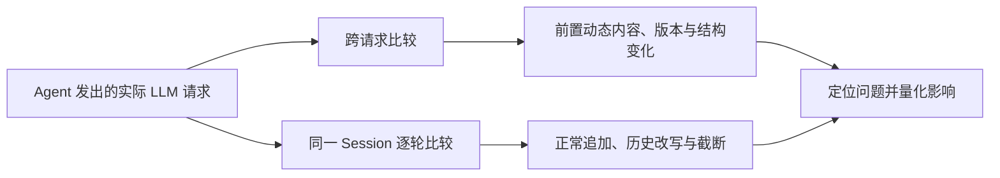

<!-- 本文件面向客户说明 actrail-kv 的请求分析能力和报告价值。 -->
# Agent 请求中的 KV 缓存优化机会

当请求前部频繁变化时，可能减少后续固定上下文的前缀复用机会。actrail-kv 分析 Agent 实际发出的 LLM 请求，定位这类变化发生在哪里、影响多少请求，以及变化之后有多少固定上下文受到影响。

跨请求分析需要积累多条相似请求，并且变化位置之后仍有重复出现的固定内容。提供 Session ID 后，还可以逐轮区分正常追加的新内容与已有历史被改写或截断。



## 六类常见问题

| 问题类型 | 典型场景 |
|---|---|
| 动态内容放得过早 | 时间、用户画像、RAG 结果或任务状态出现在大段固定内容之前 |
| 提示词或工具定义不一致 | 多版本提示词混用，工具说明或参数结构随请求变化 |
| 请求结构不稳定 | 工具、消息、示例或内容块时有时无、顺序不固定 |
| JSON 文本格式漂移 | 相同数据被序列化成不同的字段顺序、空格或换行 |
| 同一模板有多处优化机会 | 动态结果与固定内容交替出现，修复前一处后仍有后续位置可优化 |
| 会话历史被反复改写 | 已有工具结果、状态或早期消息在后续轮次中发生变化 |

## 1. 动态内容放在固定上下文之前

| 常见现象 | actrail-kv 的发现 | 建议排查方向 |
|---|---|---|
| 系统提示词前部每次写入当前时间、日期或随机标识 | 定位反复变化的位置，并展示其后受影响的固定上下文 | 降低时间精度，或把本轮动态信息移到更靠后的位置 |
| workspace、项目路径、租户、账号或用户 ID 出现在通用规则之前 | 展示同一位置的不同内容、影响请求数及后续固定上下文规模 | 先放通用规则，再补充当前请求或用户信息 |
| 用户记忆、画像、地域或语言偏好放在固定指令之前 | 找出画像内容开始变化的位置 | 将个性化信息放到公共指令之后 |
| 每轮把不同的 RAG 检索结果插在固定提示词、历史或示例之前 | 识别内容变化，以及部分请求中插入或缺失的检索块 | 将检索结果作为本轮新内容追加，避免重写早期上下文 |
| TODO、任务状态、环境状态或进度块每轮重新生成 | 定位状态内容的变化或整块增删 | 保留已有历史，仅追加最新状态 |
| 长文本中只有 workspace、ID 或状态值变化 | 定位字符串内部的具体变化位置 | 拆分固定文本与动态值，并调整拼接顺序 |
| few-shot 示例时有时无或动态替换 | 识别示例内容变化、插入或缺失及其后受影响的固定内容 | 固定公共示例集，或把动态示例移到固定内容之后 |

报告提供原始请求中的位置和内容样例，便于结合业务含义定位负责生成该内容的 Agent 组件。

## 2. 提示词或工具定义不一致

| 常见现象 | actrail-kv 的发现 | 建议排查方向 |
|---|---|---|
| 同一提示词同时存在少量稳定版本 | 展示各版本及其出现次数 | 检查灰度版本是否随机混用、实例配置是否一致、模板来源是否统一 |
| 提示词几乎每次都不同 | 定位持续变化及其最早发生的位置 | 检查模板拼接、动态渲染和版本发布流程 |
| 同一工具的说明在不同请求中存在多个版本 | 展示工具说明的固定版本或持续变化 | 统一工具定义的注册来源 |
| 工具参数结构在同类请求中变化 | 定位发生变化的工具定义及后续受影响内容 | 检查参数结构是否按请求临时生成，字段、类型或默认值是否意外变化 |

## 3. 工具、消息和内容块不稳定

| 常见现象 | actrail-kv 的发现 | 建议排查方向 |
|---|---|---|
| 每轮临时增加或删除部分工具 | 识别工具定义的插入或缺失 | 保持工具集合稳定，通过指令控制本轮可用工具 |
| 同一组工具每次注册顺序不同 | 工具名称唯一且集合相同时，明确展示工具重排 | 检查工具注册是否来自无序集合遍历或并发汇总 |
| 历史消息中间插入或删除消息 | 定位结构变化的位置及变化后再次出现的固定历史 | 按固定规则生成消息，只在末尾追加新内容 |
| 多模态或结构化内容块时有时无、顺序变化 | 展示内容块的插入、缺失或混合变化 | 固定内容块的生成条件和顺序 |
| 同一区域既有内容变化，又在部分请求中完全缺失 | 将同一位置的变化合并展示 | 检查是否有多个条件分支以不同方式生成该区域 |

## 4. 模型可见的 JSON 文本格式漂移

| 常见现象 | actrail-kv 的发现 | 建议排查方向 |
|---|---|---|
| 消息或工具结果是完整 JSON，数据相同但字段顺序、空格或换行不同 | 标记为“数据相同、表示方式不同” | 统一 JSON 字段顺序、空白和换行规则 |
| 固定标签后紧跟完整 JSON，例如 `Config JSON: {...}` | 标签相同时识别后续 JSON 的格式漂移 | 统一标签后 JSON 的序列化方式 |
| JSON 数组顺序或字段值实际变化 | 展示具体内容变化 | 确认数据变化是否符合预期，并稳定数组生成顺序 |

这项分析针对实际进入模型上下文的 JSON 字符串，不涉及 HTTP 请求外层对象的文本格式。

## 5. 同一模板中的多处优化机会

一个请求可能由动态结果和固定内容交替组成：

```text
公共内容 → 动态结果 1 → 固定内容 → 动态结果 2 → 固定内容
```

报告优先展示最早形成明显影响的问题，也会提示其后的独立变化位置，便于分阶段优化。后续位置属于条件性机会：只有更早的变化不再阻断前缀时，它才可能成为下一处需要处理的位置。

## 6. 同一会话中的历史变化

跨轮分析的核心，是区分“本轮首次追加的动态结果”和“后续请求改写已有历史”。前者是 Agent 正常执行过程，后者会缩短后续请求可保留的相同前缀。

| 同一 Session 中的现象 | actrail-kv 的发现 | 建议排查方向 |
|---|---|---|
| 请求内容完全不变 | 展示为完全相同 | 确认是否为重试或重复调用 |
| 在历史尾部追加新的完整用户或助手消息 | 展示为正常追加 | 无需为正常的新一轮消息调整结构 |
| 在历史尾部追加新的完整工具调用或工具结果消息 | 展示为正常追加 | 动态执行结果首次进入上下文无需消除 |
| 下一轮原样保留旧工具结果，再追加新消息 | 展示后续请求保留了多长的相同前缀 | 保持已有结果不变，继续在尾部追加 |
| 后续请求改写已经存在的工具结果 | 定位旧结果中最早的变化及受影响历史 | 检查 request ID、trace ID、耗时等字段是否被重新生成 |
| 每轮改写旧的系统提示词、记忆、TODO 或环境状态 | 定位已有历史发生变化的位置 | 保持旧内容不变，只在末尾追加新状态 |
| 用摘要替换早期消息，或在旧历史中间插入、删除、重排消息 | 定位旧历史最早发生变化的位置 | 降低压缩频率，在明确的阶段边界统一处理 |
| 从历史尾部缩短已有内容 | 记录为从尾部缩短，与已有历史被改写区分开 | 确认是否符合回滚、重试或恢复流程的预期 |
| 滑动窗口从头移除早期消息 | 定位历史最早发生变化的位置 | 检查滑动窗口是否过早或过于频繁地改变会话开头 |
| 同一位置在多个轮次或 Session 中反复变化 | 汇总发生次数、影响 Session 数和典型位置 | 优先处理高频且影响历史较长的生成逻辑 |

### 如何启用跨轮分析

采集请求时，为同一条无并发分支的会话持续提供相同的 Session ID：

```text
X-Actrail-Session-Id: <稳定的会话标识>
```

actrail-kv 会按照时间顺序比较同一 Session 的相邻请求。

## 报告提供的信息

- 问题在原始请求中的具体 JSON 位置。
- 代表性的内容变化、插入、缺失或重排证据。
- 受影响的请求数量，以及变化后重复出现的固定上下文规模。
- 同一 Session 中已有会话历史的保留比例和最早变化位置。
- 历史变化发生的次数、影响的 Session 数量和失效的旧历史规模。
- 与问题类型对应的排查和调整方向。

## 适用范围

- 分析对象是 Agent 最终发出的 OpenAI-compatible chat 请求，需包含字符串 `model` 和数组 `messages`；也可包含 `tools`、内容块和工具调用历史。
- 跨请求分析需要多条相似请求，并要求变化位置之后存在重复出现的固定内容。
- 跨轮分析需要为同一条顺序明确、无并发分支的会话提供相同的 `X-Actrail-Session-Id`；未提供时，跨请求分析仍可使用。

报告衡量请求结构中的复用机会，不代表推理服务的实际 KV 命中统计。调整请求后，应通过实际业务验证其语义和效果。
